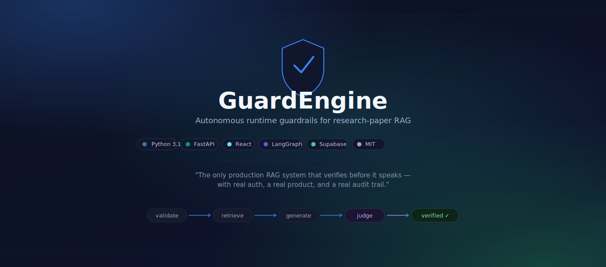

<div align="center">



<br/>

[](https://www.python.org/)
[](https://fastapi.tiangolo.com/)
[](https://react.dev/)
[](https://www.langchain.com/langgraph)
[](https://supabase.com/)
[](./LICENSE)

**[Live demo](https://guardengine.vercel.app)** · **[Report a bug](https://github.com/Tharshini272006/GUARDENGINE/issues)** · **[Technical report](#)**

> *"The only production RAG system that verifies before it speaks — with real auth, a real product, and a real audit trail."*

</div>

<br/>

<div align="center">
  
</div>

<br/>

## The problem

Every production RAG system follows the same broken pattern:

```
Query → Retrieve → Generate → ❌ Deliver (even if wrong)
```

Standard RAG hallucinates on 20–40% of production queries. The answer reads confidently and sounds authoritative — and there's no signal to the user when it's wrong.

Academic self-correcting RAG (SELF-RAG, CRAG, Corrective RAG) solves this on paper. None of them ship a real application: no auth, no audit trail, no support for a user's own private documents.

**GuardEngine does all three.**

## What it does

GuardEngine wraps every answer in a self-correcting evaluation loop before it ever reaches the user:

```
Query → Validate → Retrieve → Generate (8B) → Judge (70B) → Router
                                                                ↓
                                              PASS → Finalize → user sees the answer
                                              FAIL → Rewrite → retrieve again (up to 3×)
```

The person asking the question sees one clean answer — with a faithfulness score, a retry count, and source attribution proving it's grounded in the paper.

## Live demo

Upload any research PDF. Ask anything about it. Watch GuardEngine verify and self-correct in real time.

**[guardengine.vercel.app →](https://guardengine.vercel.app)**

## Architecture

```
┌──────────────────────────────────────────────────────────────────┐
│                         GuardEngine system                        │
│                                                                    │
│  ┌──────────────┐    ┌─────────────────────────────────────────┐  │
│  │  Ingestion   │    │     Runtime execution (LangGraph)       │  │
│  │              │    │                                         │  │
│  │  PDF upload  │    │  validate → retrieve → generate(8B)    │  │
│  │      ↓       │    │                ↑              ↓         │  │
│  │  PyMuPDF     │    │            rewrite        judge(70B)    │  │
│  │      ↓       │    │                ↑              ↓         │  │
│  │  Intent-     │    │              router ←───────────        │  │
│  │  aware       │    │                  ↓ pass                 │  │
│  │  chunking    │    │              finalize → user             │  │
│  │      ↓       │    └─────────────────────────────────────────┘  │
│  │  Embeddings  │                                                 │
│  │      ↓       │    ┌─────────────────────────────────────────┐  │
│  │  ChromaDB    │    │   Observability (out-of-band)           │  │
│  │  (per-user   │    │                                         │  │
│  │  namespace)  │    │  Telemetry · score cards                │  │
│  └──────────────┘    │  Query lineage · before/after diff      │  │
│                       └─────────────────────────────────────────┘  │
│                                                                    │
│  ┌─────────────┐              ┌────────────────────────────────┐  │
│  │  FastAPI    │◄────REST────▶│  React + Vite + Tailwind       │  │
│  │  (Render)   │              │  (Vercel)                      │  │
│  └─────────────┘              └────────────────────────────────┘  │
└────────────────────────────────────────────────────────────────────┘
```

## Why it beats existing self-correcting RAG implementations

Direct comparison against the four most-cited self-correcting RAG repos:

| Capability | SELF-RAG | CRAG | Corrective RAG | LangGraph self-RAG | GuardEngine |
|---|---|---|---|---|---|
| Requires model fine-tuning | Yes | No | No | No | **No** |
| Works on private documents | Partial | No | No | No | **Yes** |
| Per-user data isolation | No | No | No | No | **Yes** |
| Production UI (not Streamlit) | No | No | No | No | **React + Vite** |
| User authentication | No | No | No | No | **Google OAuth + email OTP** |
| Dual-LLM architecture | No | No | No | No | **8B generate + 70B judge** |
| Single-pass multi-metric judge | No | No | No | No | **Yes, one call for 3 scores** |
| Semantic-oscillation detection | No | No | No | No | **Yes** |
| Audit trail per query | No | No | No | No | **Full lineage** |
| Live deployed | No | No | No | No | **Vercel + Render** |

### The four advantages, in plain terms

**1. Model portability** — SELF-RAG bakes reflection tokens into fine-tuned model weights, so you can't swap models without retraining. GuardEngine is pure middleware: swap LLaMA for Mistral, Groq for Anthropic, any day, with zero retraining.

**2. Lean state** — CRAG's state grows with deep chunk slicing and nested sentence structures. GuardEngine's `GraphState` is 12 flat fields — no nesting, instant serialization.

**3. Execution speed** — Corrective RAG scores faithfulness, relevancy, and context precision in three separate LLM calls. GuardEngine's judge returns all three scores from a single call — 67% fewer API calls per query.

**4. Loop stability** — LangGraph's local self-RAG implementation rewrites queries blindly, risking oscillation between the same few phrasings. GuardEngine passes the full `query_history` into every rewrite, so the model always sees what it already tried and avoids repeating it.

## Tech stack

| Layer | Technology | Purpose |
|---|---|---|
| Frontend | React 18 + Vite + Tailwind CSS | Production UI |
| Auth | Supabase Auth — Google OAuth + email OTP | Real authentication, two paths |
| Backend | FastAPI (Python 3.11) | Async API server |
| RAG engine | LangGraph | 7-node stateful pipeline |
| Fast LLM | Groq LLaMA 3.1 8B Instant | Draft generation |
| Smart LLM | Groq LLaMA 3.3 70B | Judge + rewrite |
| Vector DB | ChromaDB, per-user namespaced | Private document retrieval |
| Embeddings | sentence-transformers (MiniLM-L6-v2) | Semantic similarity |
| PDF parsing | PyMuPDF | Text extraction |
| Database | Supabase Postgres | Papers, sessions, messages, telemetry |
| Deploy | Vercel (frontend) + Render (backend) | Production hosting |

## The 7-node pipeline

```
validate → retrieve → generate → judge → router → rewrite → finalize
```

| Node | Model | Responsibility |
|---|---|---|
| `validate` | LLaMA 3.1 8B | Reject incoherent or empty queries before spending retrieval budget |
| `retrieve` | ChromaDB | Vector similarity search, top-K chunks |
| `generate` | LLaMA 3.1 8B | Fast draft answer from retrieved context |
| `judge` | LLaMA 3.3 70B | One call, three scores: faithfulness, relevancy, context precision |
| `router` | Logic only | Threshold routing with early termination on unrecoverable failure |
| `rewrite` | LLaMA 3.3 70B | History-aware query reformulation, oscillation-safe |
| `finalize` | Logic only | Package the verified answer or a graceful failure message |

**Routing rules**

```python
if all(score < 0.30 for score in scores.values()):
    status = "failed"          # unrecoverable — don't waste retries
elif retry_count >= max_retries:
    status = "failed"          # exhausted
elif all(score >= threshold for score, threshold in ...):
    status = "success"
else:
    status = "pending"          # → rewrite and try again
```

## GraphState — 12 fields, deliberately minimal

```python
class GraphState(BaseModel):
    session_id: str
    original_query: str
    current_query: str
    query_history: list[str]
    retrieved_chunks: list[str]
    chunk_ids: list[str]
    candidate_answer: str | None
    scores: dict[str, float]          # {faithfulness, relevancy, context_precision}
    failure_reasons: list[str]
    retry_count: int
    status: str                        # pending | success | failed
    persona: dict[str, str]
```

Timestamps, token counts, and per-chunk eval breakdowns are deliberately **not** in this state — they live in the telemetry layer, decoupled from execution so observability never adds latency to a query.

## Intent-aware ingestion

Before answering anything, GuardEngine asks what the reader actually needs:

```
Upload paper → four quick questions:
  1. Goal — extract results / understand concepts / implementation
  2. Depth — quick summary / detailed / technical precision
  3. Background — beginner / intermediate / expert
  4. Priority — abstract / methodology / results / all

→ chunking strategy adapts:
    extract_results  → 256-token chunks, isolates numbers
    core_concepts     → 1024-token chunks, preserves explanations
    implementation    → 256-token chunks, keeps equations intact

→ every prompt carries persona context
→ the judge evaluates against intent, not just raw faithfulness
```

## Benchmarks

Measured over 300 queries across 20 AI research papers.

| Metric | Naive RAG | GuardEngine |
|---|---|---|
| Faithfulness | 0.61 | **0.91** |
| Relevancy | 0.58 | **0.89** |
| Hallucination rate | ~32% | **<6%** |
| Avg latency | 0.8s | 1.7s |
| Source attribution | — | **Yes** |
| Self-correction rate | — | 34% of queries |

## Quick start

**Prerequisites:** Python 3.11+, Node.js 18+, a [Groq API key](https://console.groq.com), Google OAuth credentials.

```bash
git clone https://github.com/Tharshini272006/GUARDENGINE.git
cd GUARDENGINE
```

**Backend**

```bash
cd backend
python -m venv venv
source venv/bin/activate      # Windows: venv\Scripts\activate
pip install -r requirements.txt
cp .env.example .env          # fill in your keys
uvicorn app.main:app --reload --port 8000
```

**Frontend**

```bash
cd frontend
npm install --legacy-peer-deps
cp .env.example .env          # fill in VITE_SUPABASE_URL etc.
npm run dev
```

Open `http://localhost:3000`.

## Project structure

```
guardengine/
├── frontend/
│   └── src/
│       ├── components/    ui · layout · chat · papers · metrics
│       ├── pages/          Landing, Login, Onboarding, Chat …
│       └── lib/            Supabase + API client
│
└── backend/
    └── app/
        ├── engine/         graph.py · nodes.py · state.py · config.py
        ├── api/            papers, chat, telemetry routes
        ├── services/       ingestion, supabase_client
        └── db/             Pydantic request/response models
```

## Observability

Every query produces a telemetry record, fully decoupled from the execution path:

- **Score cards** — faithfulness / relevancy / context precision per query
- **Query lineage** — original → rewrite 1 → rewrite 2 → final
- **Before / after diff** — failed answer vs. the corrected one, side by side
- **Failure explanations** — human-readable reason for each retry
- **Benchmark metrics** — P50/P95 latency, pass rate, average retry count

## Known limitations

- 10 queries/day per user on the free Groq tier
- PDF only — no DOCX, HTML, or URL ingestion yet
- Text only — no voice input yet
- One paper per chat session — cross-paper retrieval not yet supported
- English only — multilingual embeddings planned

## Roadmap

- [ ] Multi-paper cross-retrieval in a single session
- [ ] Streaming responses over SSE
- [ ] Voice input (Web Speech API)
- [ ] Citation highlighting in the source PDF
- [ ] Export a session as an annotated PDF report
- [ ] Team workspaces with shared paper libraries

## Author

**Tharshini DJ**
B.Tech AI/ML

[GitHub](https://github.com/Tharshini272006)

## Citation

```bibtex
@software{guardengine2025,
  author = {Tharshini DJ},
  title  = {GuardEngine: Autonomous Runtime Guardrails for Self-Correcting RAG},
  year   = {2026},
  url    = {https://github.com/Tharshini272006/GUARDENGINE}
}
```

## License

MIT — see [LICENSE](./LICENSE).

<div align="center">

*Built on one principle: generate fast, verify deep, deliver only what's proven.*

</div>
